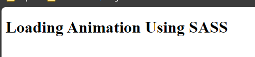
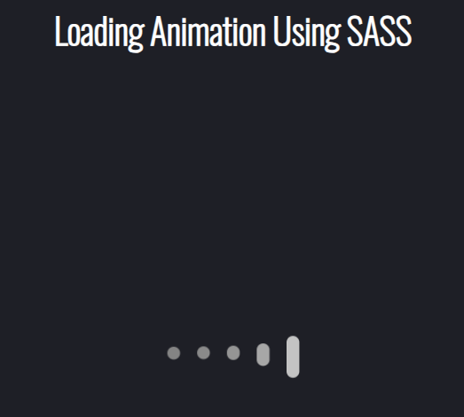

## demo for node-sass

This is a demo for node-sass.

## How to use

In the terminal run 

```bash
npm install
```

You can open the `index.html` in your browser to see the result. or use live server.

You should see: 

Then run 

```bash
npm run sass
```

You should then see  the animated loader stylled with the compiled css.

If you look at the package json this runs 

```bash
node-sass src/scss/ -o src/css/
```

Which will take all files in the `scss`, compile them to css and minify and then create a corrisponding file in the `css` folder.

I have excluded all `*.css` files in the in `src/css`folder to ensure that you get the compiled css.

### test